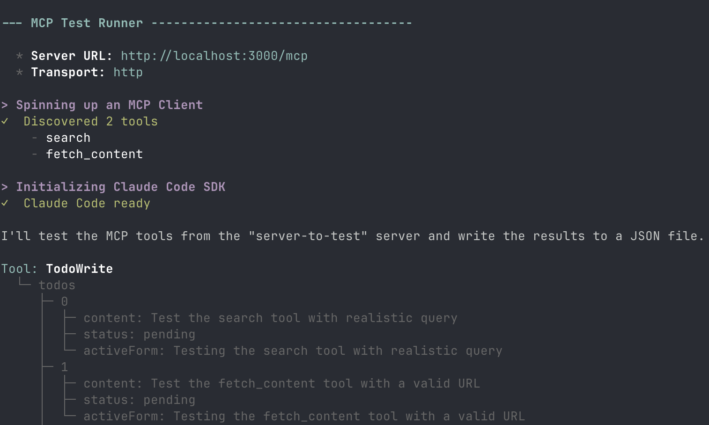

# MCP Testing Agent

> Can Claude accurately use your MCP server tools?



Automated testing tool for remote model context protocol (MCP) servers.

Claude Code tries to use all available tools exposed by an MCP server and generates test reports.

The tool automatically discovers available tools from the MCP server using the official MCP client SDK before testing begins.

## Features

- **Auto-discovery**: Automatically discovers and tests all available MCP tools
- **AI-powered testing**: Uses Claude + faker-js to generate realistic test data and validate responses
- **Comprehensive reports**: Generates detailed JSON reports with test results
- **Clean testing**: Attempts to clean up created resources after testing
- **Authentication support**: Supports custom headers for authenticated endpoints

## Prerequisites

### Required

1. **Claude Code CLI must be installed globally:**

```bash
npm install -g @anthropic-ai/claude-code
```

2. **Set your Anthropic API key:**

```bash
export ANTHROPIC_API_KEY=your-api-key
```

Or create a `.env` file (Bun will load it automatically):

```
ANTHROPIC_API_KEY=your-api-key
```

## Limitations

- Currently only supports HTTP streaming transport
- Requires an Anthropic API key
- Testing is limited to 50 turns to prevent infinite loops
- Large response outputs may be truncated in console logs

### Troubleshooting

If you encounter "Claude Code executable not found" errors:

```bash
# Set the path to your Claude installation
export CLAUDE_CODE_PATH=$(which claude)
```

## Installation

### Quick Start (with npx)

```bash
npx @stackone/mcp-test --transport http --url http://localhost:3000/mcp
```

### Global Installation

```bash
npm install -g @stackone/mcp-test
mcp-test --transport http --url http://localhost:3000/mcp
```

### From Source

```bash
git clone https://github.com/your-org/mcp-connectors.git
cd apps/mcp-test
bun install
bun start --transport http --url http://localhost:3000/mcp
```

## Usage

Test an MCP server running locally:

```bash
mcp-test --transport http --url http://localhost:3000/mcp
```

### With Authentication

Include authentication headers:

```bash
mcp-test \
  --transport http \
  --url https://api.example.com/mcp \
  --headers '{"Authorization": "Bearer your-token"}'
```

## How It Works

The testing tool follows this process:

1. **Connect to MCP server**: Establishes connection using the MCP client SDK
2. **Discover tools**: Automatically discovers all available tools by calling `listTools()` on the official MCP client SDK
3. **Configure Claude Code**: Sets up Claude Code SDK with the discovered tools
4. **Test each tool**: Systematically tests each discovered tool with realistic data
5. **Generate report**: Creates a detailed JSON report with test results

### Test Process

For each discovered tool, the tool:

- Generates realistic input data using AI
- Calls the tool with the generated data
- Validates the response
- Documents success/failure status
- Provides improvement suggestions when applicable
- Attempts cleanup of any created resources

## Output

Test results are saved to `.agent/results_<server>_<timestamp>.json` with the following structure:

```json
{
  "timestamp": "2025-01-09T10:30:00.000Z",
  "server_url": "http://localhost:3000/mcp",
  "tool_count": 2,
  "tools_tested": [
    {
      "name": "search",
      "input": {
        "query": "python programming tutorial",
        "maxResults": 5
      },
      "expected_output": "list of search results with urls and summaries",
      "actual_output": { ... },
      "success": true,
      "suggestions": "consider adding pagination support"
    }
  ]
}
```

## Development

### Prerequisites

- Node.js 18+ or Bun
- TypeScript
- An Anthropic API key

### Setup

```bash
# Clone the repository
git clone https://github.com/your-org/mcp-connectors.git
cd apps/mcp-test

# Install dependencies
bun install

# Run tests
bun test

# Build for production
bun run build
```

## License

MIT
